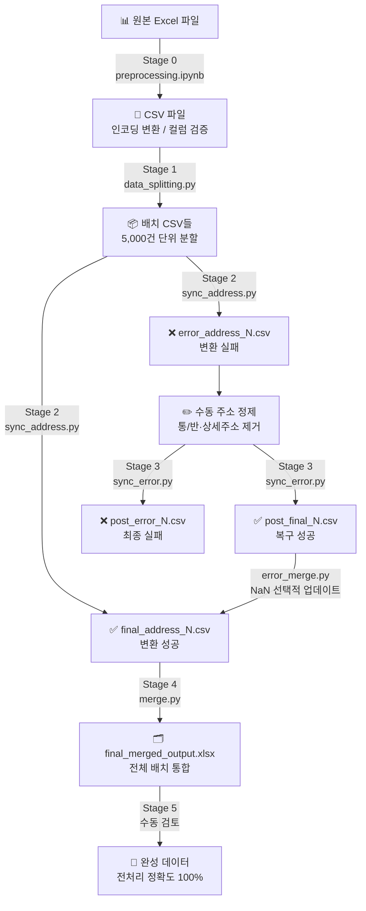
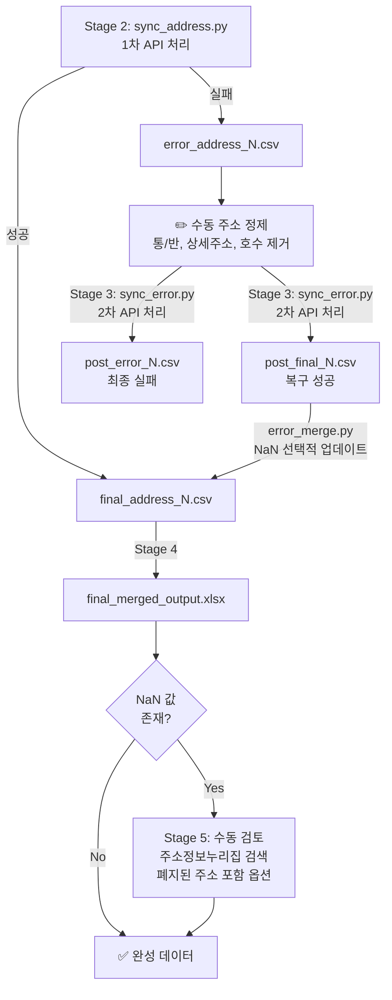

# 한국 주소 데이터 처리 파이프라인 — PPT 구성 자료

> PPT 에이전트 전달용. 슬라이드 구성에 활용할 수 있도록 문제 상황 → 조사 → 아키텍처 → 액션 → 성과의 흐름으로 정리하였습니다.

---

## 슬라이드 1. 표지 (Title)

**프로젝트명:** 한국 주소 데이터 전처리 자동화 파이프라인

**한 줄 요약:** API 자동화 파이프라인 및 2단계 복구 시스템 구축으로 일일 데이터 처리량 3,200% 향상, 80만 건 감염자 주소 데이터 100% 표준화

**키워드:** `Python` · `Juso API` · `Batch Processing` · `Error Recovery` · `Data Pipeline`

---

## 슬라이드 2. 문제 상황 — 배경 (Context)

**프로젝트 배경**
- 부산대학교 병원 코로나19 감염자 데이터 약 **80만 건** 전처리
- 최종 수요자(연구자·정책가)의 요구사항: **행정구역(시/도, 시/군/구, 읍/면/동) 데이터 100% 정확도**

**나의 역할**
- 주소 데이터 전처리 파이프라인 **설계 및 구축**
- 팀 내 협업을 위한 **기술 가이드라인 배포**

---

## 슬라이드 3. 문제 상황 — 핵심 장벽 (Problem)

**두 가지 핵심 장벽**

| 장벽 | 내용 |
|------|------|
| 기술적 한계 | 도로명 주소 ↔ 지번 주소 체계 차이 → 단순 정규식으로 행정구역 변환 불가 |
| 시간적 한계 | 수동 웹검색 시 일일 최대 5,000건 → 전체 처리 약 160일 → 마감 기한 내 완수 불가 |

**결론:** 대규모 데이터를 안정적으로 처리할 수 있는 **자동화 파이프라인 구축이 필수적**

---

## 슬라이드 4. 조사 및 발견 — Juso API (Research 1)

**조사 대상:** 행정안전부 주소정보누리집 Juso API 및 도로명 주소 체계 표준 가이드

**핵심 발견 1: Juso API 활용 가능성 확인**
- Juso API는 대한민국 도로명 주소 ↔ 지번 주소 매칭 데이터베이스를 API 형식으로 제공
- 비정형 도로명 주소를 표준 행정구역 데이터로 **자동 변환하는 수단**으로 활용 가능

**핵심 발견 2: API 요청 실패 패턴 파악**
- 상세주소(층·호수), 통/반 정보 등 비표준 형식 포함 시 API 요청 실패
- 정규식으로 사전 정제해도 다양한 오류 잔존 → **사람이 직접 개입하는 수동 정제 단계 필요**

---

## 슬라이드 5. 조사 및 발견 — 잔여 오류 패턴 (Research 2)

**핵심 발견 3: 최종 잔여 오류 유형 파악**
- 수동 정제 후에도 약 **0.3%**는 변환 불가
- 주원인: 폐지된 주소(도로명 변경·폐지), 1차 수정 과정에서의 누락

| 유형 | 원본 주소 예시 | 처리 방법 |
|------|--------------|----------|
| 상세주소 포함 | 부산광역시 동구 홍곡남로 6 **동신탕 3층** | 건물명·층수 제거 |
| 통/반 정보 포함 | 부산광역시 사상구 백양대로433번길 9 **7통 4반** | 통/반 정보 제거 |
| 정규식 처리 오류 | 부산광역시 해운대구 센텀3로 26 **3009호** | 호수 정보 제거 |
| 폐지된 주소 | 도로명 변경·폐지된 주소 | 주소정보누리집 "폐지된 주소 포함" 옵션으로 검색 |

---

## 슬라이드 6. 아키텍처 — 6단계 파이프라인 전체 구조 (Architecture 1)

**파이프라인 6단계 구조**

| 단계 | 스크립트 | 역할 |
|------|----------|------|
| Stage 0 | preprocessing.ipynb | Excel → CSV 변환 |
| Stage 1 | data_splitting.py | 5,000건 단위 배치 분할 |
| Stage 2 | sync_address.py | Juso API 호출 → 성공/실패 분리 |
| Stage 3 | sync_error.py + error_merge.py | 실패 주소 수동 정제 후 재처리 (1차 복구) |
| Stage 4 | merge.py | 전체 배치 통합 → Excel 출력 |
| Stage 5 | 수동 검토 | 최종 NaN 값 직접 입력 (2차 복구) |

---

## 슬라이드 7. 아키텍처 — 2단계 에러 복구 시스템 (Architecture 2)

**에러 복구 흐름 상세**

**설계 핵심 원칙**
- `pd.isna()` 체크 → 이미 성공한 데이터 덮어쓰기 방지
- 원본 인덱스 보존 → 배치 분할 이후에도 정확한 위치에 결과 병합
- 자동 정제(정규식) + 수동 개입 조합 → 100% 정확도 달성

---

## 슬라이드 8. 실행한 액션 1 — 자동 변환 파이프라인 구축 (Action 1)

**Action 1. REST 통신 기반 자동 변환 파이프라인 설계**

- 수작업 한계 극복을 위해 Juso API를 활용한 6단계 배치 처리 파이프라인 구축
- **5,000건 단위 배치 분할** → 네트워크 장애 시 최대 손실 범위를 33분으로 제한
- **API 재시도 로직 (3회, 3초 간격)** → 일시적 네트워크 오류 자동 복구

**배치 크기 선정 근거**

| 배치 크기 | 처리 시간 | 장애 시 최대 손실 |
|----------|----------|----------------|
| 1,000건 | ~8분 | 8분 / 파일 수 과다 |
| **5,000건** | ~33분 | **33분 (채택)** |
| 10,000건 | ~67분 | 67분 |
| 50,000건+ | ~5.5시간 | 네트워크 타임아웃 위험 |

---

## 슬라이드 9. 실행한 액션 2·3 — 복구 시스템 & 팀 표준화 (Action 2·3)

**Action 2. 2단계 에러 복구 시스템 구축**

- **1차 복구**: API 실패 주소를 도로명 주소 표준 가이드에 맞게 수동 정제 후 재요청
- **2차 복구**: 최종 병합 후 잔여 NaN 값을 주소정보누리집에서 검색하여 수동 입력
- 결과: 전처리 정확도 **100% 달성**

**Action 3. 팀 협업 표준화 (가이드라인 배포)**

- 노션(Notion)에 주소 정제 규칙, API 에러 대응 방법, 파이프라인 사용법 상세 문서화
- 동영상 가이드 촬영·배포 → 팀원 **5명**이 동일한 표준 프로세스로 병렬 작업 수행

---

## 슬라이드 10. 성과 및 핵심 기술 (Result)

**정량적 성과**

| 지표 | 기존 | 개선 후 |
|------|------|---------|
| 일일 처리량 | 5,000건 (수동 웹검색) | 16만 건 (자동화 파이프라인) |
| 일일 처리량 향상률 | — | **+3,200%** |
| 전체 처리 예상 기간 | 약 160일 | 약 5일 |
| 공정 시간 단축 | — | **약 32배 단축** |
| 전처리 정확도 | — | **100%** |
| 처리 완료 데이터 | — | **80만 건** |

**핵심 기술 포인트 5가지**

1. **배치 분할 처리** — 5,000건 단위로 분할하여 장애 시 손실 최소화 (최대 33분)
2. **API 재시도 로직** — 3회 재시도 + 3초 대기로 일시적 네트워크 오류 자동 복구
3. **2단계 에러 복구** — 자동(정규식 정제) + 수동(사람 개입) 조합으로 100% 정확도 달성
4. **인덱스 기반 병합** — 배치 분할 이후에도 원본 인덱스 보존으로 데이터 정합성 유지
5. **팀 협업 표준화** — 노션 가이드라인 + 동영상 매뉴얼로 5인 팀 생산성 극대화
