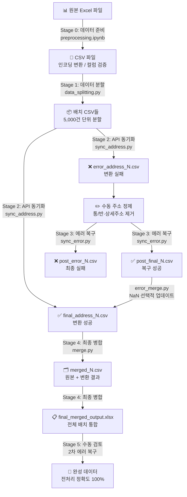
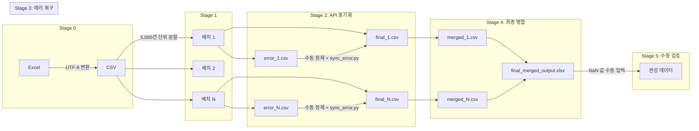
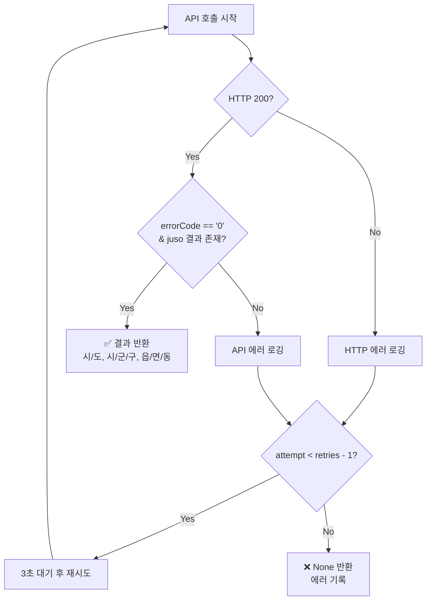
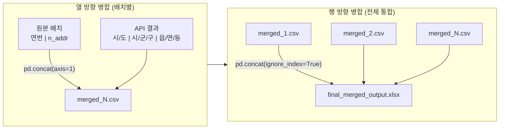
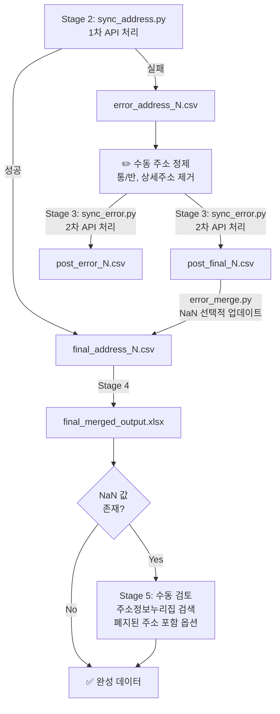

# 한국 주소 데이터 처리 파이프라인

## 프로젝트 개요

### 프로젝트 배경
본 프로젝트는 2024년 부산대학교 병원에서 의뢰한 총 80만 건 가량의 코로나 19 감염 환자 데이터의 전처리 과정에서 실행한 프로젝트입니다.
구체적으로는 부산대학교 병원에서 의뢰한 요구사항 중에서 도로명 주소에서 행정 구역 정보(시/도, 시/군/구, 읍/면/동) 정보를 추출하는 것이 있었습니다.

데이터의 크기가 80만 건에 달했기 때문에, 수동 검색(웹검색) 방식으로는 일일 최대 처리량이 약 5,000건으로, 전체 데이터를 처리하는 데 약 160일이 소요될 것으로 예상되었습니다. 이는 프로젝트 마감 기한 내 완수가 물리적으로 불가능한 상황이었습니다. 또한 도로명 주소와 지번 주소의 체계 차이로 인해 단순 정규식만으로는 변환에 한계가 있었습니다.

이를 해결하고자 행정안전부에서 제공하는 주소 API(Juso API)를 분석하여 비정형 주소를 표준 데이터로 변환하는 자동화 파이프라인을 설계하였고, API 요청 실패 원인을 면밀히 파악하여 정제 로직과 수동 개입이 조화된 2단계 에러 복구 시스템을 구축하였습니다.

### 프로젝트 소개
행정안전부에서 제공하는 주소 API(Juso API)를 활용하여 비정형 주소 데이터를 표준화된 행정구역 체계(시/도, 시/군/구, 읍/면/동)로 변환하는 데이터 처리 파이프라인입니다.

### 기술 스택
- **언어**: Python 3.x
- **데이터 처리**: Pandas
- **API 통신**: Requests
- **환경 변수 관리**: python-dotenv
- **진행 상황 표시**: tqdm
- **로깅**: Python logging 모듈

### 핵심 기능
- REST API 연동 및 자동 재시도 로직
- 대용량 데이터 배치 분할 처리
- 2단계 에러 복구 시스템
- 인덱스 기반 데이터 병합

---

## 아키텍처 설계

### 6단계 파이프라인 다이어그램



### 데이터 흐름도



### 파일 구조

```
{YYYYMM}/
├── {batch_num}/
│   ├── {batch_num}.csv                    # 원본 배치 데이터
│   ├── final_address_{batch_num}.csv       # API 변환 성공 결과
│   ├── error_address_{batch_num}.csv       # 1차 실패 주소
│   ├── merged_{batch_num}.csv              # 원본 + 변환 결과 병합
│   └── post_error_{batch_num}/
│       ├── post_final_{batch_num}.csv      # 재처리 성공 결과
│       └── post_error_{batch_num}.csv      # 최종 실패 주소
└── final_merged_output.xlsx                # 최종 통합 결과
```

---

## 기술적 하이라이트

### 1. API 통합 및 재시도 로직

#### 구현 코드

```python
def call_juso_api(address, retries=3, delay=3):
    params = {
        "currentPage": 1,
        "countPerPage": 1,
        "keyword": address,
        "confmKey": CONFIRM_KEY,
        "resultType": "json",
        "hstryYn": "Y",
    }

    for attempt in range(retries):
        try:
            response = requests.get(API_URL, params=params, timeout=50)
            if response.status_code == 200:
                data = response.json()
                if (
                    data["results"]["common"]["errorCode"] == "0"
                    and data["results"]["juso"]
                ):
                    juso = data["results"]["juso"][0]
                    return {
                        "시/도": juso.get("siNm", None),
                        "시/군/구": juso.get("sggNm", None),
                        "읍/면/동": juso.get("emdNm", None),
                    }
                else:
                    logger.error(
                        f"API Error: {data['results']['common']['errorMessage']} for address: {address}"
                    )
            else:
                logger.error(
                    f"HTTP Error: {response.status_code} for address: {address}"
                )
        except requests.exceptions.RequestException as e:
            logger.error(f"RequestException: {e} for address: {address}")

        # 재시도 전 대기
        if attempt < retries - 1:
            logger.info(f"Retrying ({attempt + 1}/{retries}) for address: {address}")
            time.sleep(delay)

    logger.error(f"All retries failed for address: {address}")
    return None
```

#### API 에러 핸들링 흐름



#### 기술적 의사결정

| 설정값 | 선택 근거 |
|--------|----------|
| `retries=3` | 일시적 네트워크 오류 대응. 3회 이상은 영구적 실패로 판단 |
| `delay=3` | API 서버 부하 방지 및 Rate Limit 회피 |
| `timeout=50` | 대용량 요청 시 응답 지연 고려 |
| `hstryYn="Y"` | 폐지된 주소도 검색하여 변환 성공률 향상 |

**3단계 에러 분류:**
1. **HTTP 에러**: 서버 연결 실패, 500 에러 등 → 재시도
2. **API 에러**: 유효하지 않은 주소, 검색 결과 없음 → 로깅 후 재시도
3. **네트워크 에러**: `RequestException` 발생 → 로깅 후 재시도

---

### 2. 배치 처리 아키텍처

#### 데이터 분할 전략

```python
# 배치 크기 설정
BATCH_SIZE = 5000

# batch_size 만큼의 배치가 총 몇개 필요한지를 계산하는 로직
total_batches = (len(df) + BATCH_SIZE - 1) // BATCH_SIZE

# enumerate()의 start=1 옵션을 사용하여 1부터 시작하는 인덱스를 사용함
for batch_num, start in enumerate(range(0, len(df), BATCH_SIZE), start=1):
    batch_df = df.iloc[start : start + BATCH_SIZE]
    folder_path = os.path.join(output_folder, str(batch_num))
    os.makedirs(folder_path, exist_ok=True)
    batch_df.to_csv(os.path.join(folder_path, f"{batch_num}.csv"), index=True)
```

#### 배치 크기 선정 근거

| 배치 크기 | 장점 | 단점 |
|----------|------|------|
| 1,000건 | 빠른 실패 복구 | 파일 수 과다, I/O 오버헤드 |
| **5,000건** | 균형잡힌 처리 단위 | - |
| 10,000건 | 파일 수 감소 | 실패 시 재처리 비용 증가 |
| 50,000건+ | - | 네트워크 타임아웃 위험 |

**5,000건 선택 이유:**
- API 호출 1건당 약 0.3~0.5초 소요 → 5,000건 처리 시 약 25~40분
- 네트워크 불안정 시 최대 손실 범위를 관리 가능한 수준으로 제한
- 중간 결과물 저장으로 진행 상황 추적 용이

#### 배치 병합 흐름



---

### 3. 에러 복구 시스템

에러 복구는 총 2회에 걸쳐 수행됩니다.



#### 주소 변환 실패 유형 및 수동 처리 전략

| 유형 | 실패 원인 | 원본 주소 예시 | 정제 후 주소 |
|------|----------|---------------|-------------|
| 폐지된 주소 | 도로명 변경/폐지 | 부산광역시 동래구 쇠미로 95 | 주소정보누리집에서 "폐지된 주소 정보 포함" 체크 후 검색 |
| 상세주소 포함 | 건물명/층/호수 잔존 | 부산광역시 동구 홍곡남로 6 동신탕 3층 | 부산광역시 동구 홍곡남로 6 |
| 정규식 처리 오류 | 숫자 패턴 오분류 | 부산광역시 해운대구 센텀3로 26 3009호 | 부산광역시 해운대구 센텀3로 26 |
| 통/반 정보 포함 | 행정 단위 잔존 | 부산광역시 사상구 백양대로433번길 9 7통 4반 | 부산광역시 사상구 백양대로433번길 9 |

#### 원본 인덱스 보존 로직 (sync_error.py)

```python
def process_addresses(df):
    results = []
    error_records = []

    for idx, address in tqdm(df["주소"].items(), total=len(df)):
        result = call_juso_api(address)
        if result is None:
            error_records.append({
                "Index": df.loc[idx, "Index"],  # 원본 인덱스 보존
                "주소": address,
                "오류": "No result or error",
            })
            results.append({
                "Index": df.loc[idx, "Index"],
                "시/도": None, "시/군/구": None, "읍/면/동": None,
            })
        else:
            results.append({
                "Index": df.loc[idx, "Index"],
                "시/도": result["시/도"],
                "시/군/구": result["시/군/구"],
                "읍/면/동": result["읍/면/동"]
            })

    return results, error_records
```

**sync_address.py vs sync_error.py 비교:**

| 항목 | sync_address.py | sync_error.py |
|------|-----------------|---------------|
| 입력 컬럼 | `n_addr` (전처리 전 원본 주소) | `주소` (수동 정제된 주소) |
| 인덱스 처리 | 순차 인덱스 생성 | 원본 `Index` 컬럼 보존 |
| 출력 구조 | `index, 시/도, 시/군/구, 읍/면/동` | `Index, 시/도, 시/군/구, 읍/면/동` |

#### NaN 값 선택적 업데이트 (error_merge.py)

```python
def main():
    final_df = pd.read_csv(final_path)
    error_df = pd.read_csv(error_path)

    for _, row in error_df.iterrows():
        idx = row["Index"]

        matching_rows = final_df[final_df["index"] == idx]
        if not matching_rows.empty:
            final_idx = matching_rows.index[0]
            # 해당 행의 '시/도' 값이 비어 있으면 업데이트
            if pd.isna(final_df.loc[final_idx, "시/도"]):
                final_df.loc[final_idx, ["시/도", "시/군/구", "읍/면/동"]] = row[
                    ["시/도", "시/군/구", "읍/면/동"]
                ]

    final_df.to_csv(final_path, index=False, encoding="utf-8-sig")
```

**선택적 업데이트 로직:**
- `pd.isna()` 체크로 이미 성공한 데이터 보호
- 인덱스 기반 정확한 위치 매칭
- 원본 파일 직접 업데이트로 데이터 일관성 유지

---

## 기술적 의사결정 및 근거

### 1. 배치 크기 선정 (5,000건)

**문제 상황:**
- 전체 데이터셋: 80만 건
- API 호출당 응답 시간: 0.3~0.5초
- 네트워크 불안정 시 전체 재처리 위험

**의사결정:**
```
전체 처리 시간 = 데이터 수 × (API 응답 시간 + 처리 오버헤드)
50,000건 × 0.4초 ≈ 5.5시간 (단일 배치 시)

실패 시 손실 비용:
- 50,000건 배치: 최대 5.5시간 손실
- 5,000건 배치: 최대 33분 손실
```

**결론:** 5,000건 배치로 실패 시 최대 손실을 33분으로 제한

### 2. 재시도 전략 (3회, 3초 간격)

| 요소 | 값 | 근거 |
|------|-----|------|
| 재시도 횟수 | 3회 | 일시적 오류는 보통 1-2회 내 복구 |
| 대기 시간 | 3초 | API Rate Limit 고려, 서버 부하 분산 |
| 타임아웃 | 50초 | 대용량 응답 시 지연 허용 |

**실패 분류:**
```
재시도로 해결 가능: 네트워크 타임아웃, 일시적 서버 오류
재시도로 해결 불가: 잘못된 주소 형식, 존재하지 않는 주소
```

### 3. 인덱스 관리 방식

**요구사항:**
- 원본 데이터와 API 결과의 정확한 매칭
- 에러 재처리 후 올바른 위치에 병합
- 전체 배치 통합 시 순서 유지

```python
# sync_address.py: 순차 인덱스 생성 (결과와 원본 행 순서 일치)
df_final = pd.DataFrame(results).reset_index()

# sync_error.py: 원본 인덱스 컬럼 보존
results.append({
    "Index": df.loc[idx, "Index"],  # 원본 인덱스 유지
    ...
})

# error_merge.py: 인덱스 기반 매칭 업데이트
matching_rows = final_df[final_df["index"] == idx]
```

### 4. 로깅 전략

```python
logging.basicConfig(
    filename="address_api_sync.log",
    level=logging.INFO,
    format="%(asctime)s [%(levelname)s] %(message)s",
)
```

**로깅 대상:**
- API 에러 메시지 (디버깅용)
- HTTP 상태 코드 (서버 문제 추적)
- 재시도 시도 횟수 (성능 분석)
- 최종 실패 주소 (수동 처리 대상 식별)

---

## 확장성 및 개선 가능성

### 현재 한계점

| 한계점 | 영향 | 원인 |
|--------|------|------|
| 단일 스레드 처리 | 처리 속도 제한 | API Rate Limit 우회 불가 |
| 수동 에러 정제 | 인력 비용 발생 | 폐지된 주소, 상세주소, 정규식 오류 등 비정형 주소 패턴 다양성 |
| 메모리 내 전체 로드 | 초대용량 데이터 처리 제한 | Pandas 기본 동작 방식 |

### 향후 개선 방향

#### 1. 비동기 처리 도입
```python
# 현재: 동기 처리
for address in addresses:
    result = call_juso_api(address)  # 블로킹

# 개선: 비동기 처리 (asyncio + aiohttp)
async def process_batch(addresses):
    tasks = [call_juso_api_async(addr) for addr in addresses]
    return await asyncio.gather(*tasks)
```

#### 2. 자동 주소 정제 규칙
```python
# 통/반 패턴 자동 제거
address = re.sub(r'\s+\d+통\s*\d*반?$', '', address)

# 상세주소 패턴 자동 제거
address = re.sub(r'\s+\d+층$', '', address)
address = re.sub(r'\s+\d+호$', '', address)
```

#### 3. 청크 단위 스트리밍 처리
```python
# 대용량 파일 청크 처리
for chunk in pd.read_csv(file_path, chunksize=1000):
    process_chunk(chunk)
    save_intermediate_result(chunk)
```

#### 4. 캐싱 레이어 추가
```python
# Redis 기반 주소 캐싱
def call_juso_api_cached(address):
    cached = redis_client.get(address)
    if cached:
        return json.loads(cached)

    result = call_juso_api(address)
    redis_client.setex(address, 86400, json.dumps(result))
    return result
```

---

## 프로젝트 성과

### 정량적 성과
- **일일 처리량 3,200% 향상**: 기존 수동 처리 5,000건 → 자동화 파이프라인 16만 건
- **프로젝트 수행 시간 약 32배 단축**: 기존 약 160일 → 자동화 파이프라인 도입 후 약 5일
- **전처리 정확도 100% 달성**: 정규식 자동 정제 + 2단계 수동 검토 병행
- **80만 건** 감염자 데이터 안정적 표준화 완료

### 기술적 성장
- REST API 통합 및 에러 핸들링 패턴 습득
- 대용량 데이터 파이프라인 설계 경험
- Python 데이터 처리 라이브러리 활용 능력 향상
- 팀 협업을 위한 기술 가이드라인 작성 및 배포 경험
